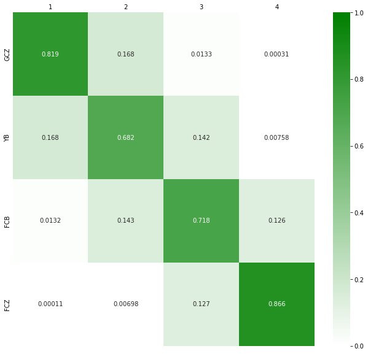
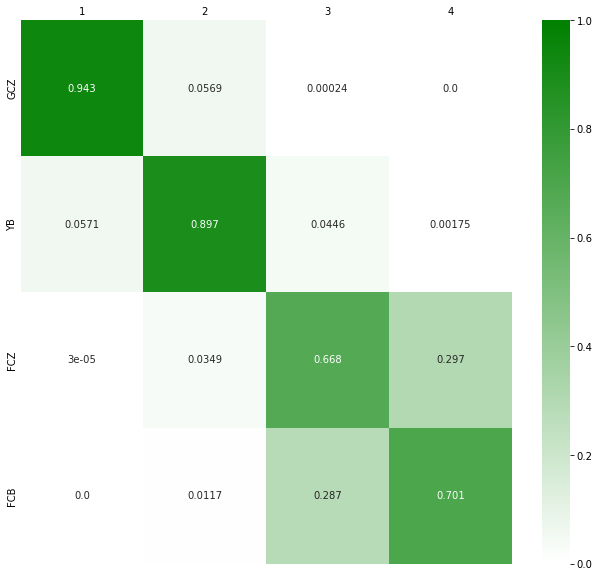
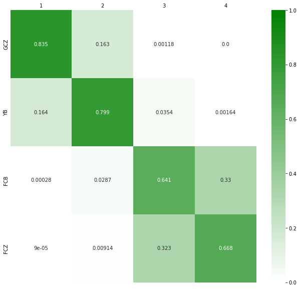

================
Tutorial: League
================

In the following, we want to simulate a full league and a league from a given schedule.
First, we import the necessary modules.

.. code:: ipython3

    from fussballgott import load, league, plot, team

There are three ways how to simulate a league:

Full League simulation
======================

Here, we simulate a full league with 4 teams that play each other 4 times. We have to 
define the teams and their strength. The strength is defined by the average number of
goals scored and conceded per game. After setting up the teams, we can simulate easily
simulate the league by setting the number of simulations (`n_sim=1e5`) and the number
of times each team plays each other (`schedule=4`).

.. code:: ipython3

    teams = {}
    teams["GCZ"] = team.Team(name="GCZ", GoalsF=3.1, GoalsA=0.9)
    teams["YB"] = team.Team(name="FCB", GoalsF=2.3, GoalsA=1.7)
    teams["FCB"] = team.Team(name="FCB", GoalsF=2, GoalsA=3.2)
    teams["FCZ"] = team.Team(name="FCZ", GoalsF=1, GoalsA=4.3)

    sim = league.simulate(teams, schedule=4, n_sim=1e5)

    plot.league(sim)

League from schedule
====================

Here, we simulate a league from a given schedule. In the schedule it is defined who
plays against whom and how often. Games that are already played can be filled in the
schedule. The schedule is a csv file with the following structure:

.. csv-table:: league_schedule.CSV
   :file: demo_league.CSV
   :header-rows: 1
   :delim: ;

This file can then be loaded and the output of the load function can be used to simulate
the league. This can also be plotted.

.. code:: ipython3

    file = "league_schedule.CSV"
    teams, schedule, table, missing_games = load.league(file)
    sim = league.simulate(teams, schedule, table, missing_games, n_sim=1e5)
    plot.league(sim)

League from schedule without results and current table
======================================================

Here, we simulate a league from a given schedule. But we do not have any results in the
schedule. We only have the current table. This mode assumes that the games are played
in order of the schedule. The schedule is a csv file with the following structure:

.. csv-table:: league_schedule.CSV
   :file: demo_league_sep_schedule.CSV
   :header-rows: 1
   :delim: ;

And the table is a csv file with the following structure:

.. csv-table:: league_table.CSV
   :file: demo_league_sep_table.CSV
   :header-rows: 1
   :delim: ;

The simulation can then be done the following way:

.. code:: ipython3

    file_sched = "demo_league_sep_schedule.CSV"
    file_tab = "demo_league_sep_table.CSV"
    teams, schedule, table, missing_games = load.league([file_sched, file_tab])
    sim = league.simulate(teams, schedule, table, missing_games, n_sim=1e5)
    plot.league(sim)

