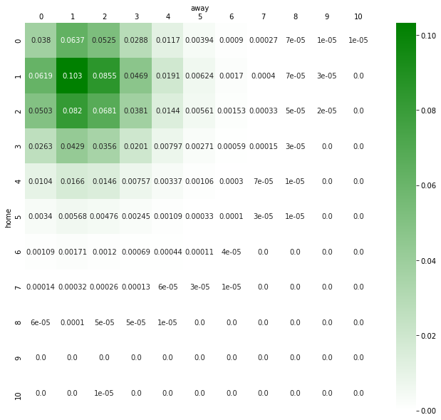
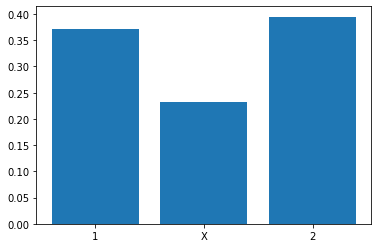

======================
Tutorial: Single Games
======================

This tutorial shows how to simulate a single game and how to plot the results. First,
we import the necessary modules. Then, we simulate one game between two teams without
extra time and penalty shootout. The result is a 3:1 win for the home team.

.. code:: ipython3

    from fussballgott import fussball, plot
    import numpy as np

    np.random.seed(1886)
    home, away = fussball.simulate_game(
        AvGoalsF1=2,
        AvGoalsF2=1.5,
        AvGoalsA1=1.8,
        AvGoalsA2=1.2,
        include_goals_against=True,
    )
    print("Result of the game: {}:{}".format(home, away))

.. parsed-literal::

    Result of the game: 3:1

Now we want to simulate the same game with extra time and penalty shootout. The result
is a 5:3 win for the home team after extra time. The result after regular time is a
2:2 draw.

.. code:: ipython3

    np.random.seed(2003)

    home, away, when, home90, away90 = fussball.simulate_game(
        AvGoalsF1=2,
        AvGoalsF2=1.5,
        AvGoalsA1=1.8,
        AvGoalsA2=1.2,
        include_goals_against=True,
        extra_time=True,
        return_when=True,
    )
    print("Result of the game: {}:{} after {}".format(home, away, when))
    print("Result after regular time: {}:{}".format(home90, away90))

.. parsed-literal::

    Result of the game: 5:3 after AET
    Result after regular time: 2:2

Finally, we do not only want to simulate a single game, but we want to know the
probability of a win, draw or loss for the home team. We can do this by simulating
many games and counting the results. The function ``simulate_game_stats`` does this
for us. It returns a table of results and the win probabilities.
    
.. code:: ipython3

    stat, winprob = fussball.simulate_game_stats(
        AvGoalsF1=2,
        AvGoalsF2=1.5,
        AvGoalsA1=1.8,
        AvGoalsA2=1.2,
        include_goals_against=True,
    )

.. code:: ipython3

    plot.game_stat(stat, winprob)

