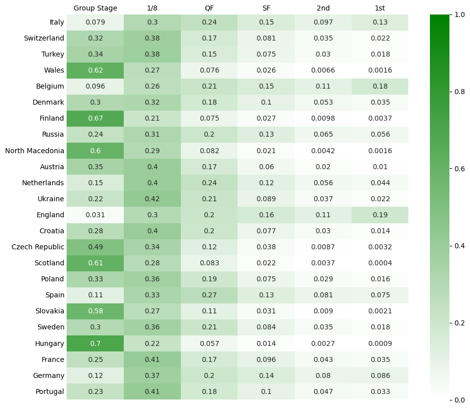

=====================
Tutorial: Tournaments
=====================

Simulating tournaments like the World Cup require some more preparations. In the
following, we will show how to simulate the 2021 European Championship. First, we import
the necessary packages.

.. code:: ipython3

    from fussballgott import load, plot, tournament

Then, we have to prepare the data. This requires the following steps:

1. Setup up the tournament `mode` in a csv file of the following format:

  .. csv-table:: tournament_mode.CSV
      :file: demo_tournament_mode.csv
      :header-rows: 0
      :delim: ;

2. Setup all the `teams` in a csv file of the following format:

  .. csv-table:: tournament_teams.CSV
      :file: demo_tournament_teams.csv
      :header-rows: 1
      :delim: ;

3. Setup the knockout round with a file for each round. The file format for the first
   knockout round is as follows:

  .. csv-table:: tournament_8.CSV
      :file: demo_tournament_8.csv
      :header-rows: 1
      :delim: ;

  The file format for the second knockout round is as follows:

  .. csv-table:: tournament_4.CSV
      :file: demo_tournament_4.csv
      :header-rows: 1
      :delim: ;

  and so on. Note that the title of the csv file contains the number of the round. So 
  for the quarterfinals, the file name should be ``tournament_4.csv``, for the semifinals
  ``tournament_2.csv``, etc. 

4. In the special case of the European Championship, there were also some of the third
   placed teams that advanced to the knockout round. The way that these teams are
   assigned to the knockout round is also specified in a csv file:

  .. csv-table:: tournament_special_rule.CSV
      :file: demo_tournament_special_rule.csv
      :header-rows: 1
      :delim: ;

Now, after preparation, we can load the data and simulate the tournament.

.. code:: ipython3

    mode, ko_round, teams, groups = load.tournament("demo_tournament_")
    sim = tournament.simulate(mode, ko_round, teams, groups, n_sim=1e4)

.. code:: ipython3

    plot.tournament(sim)

